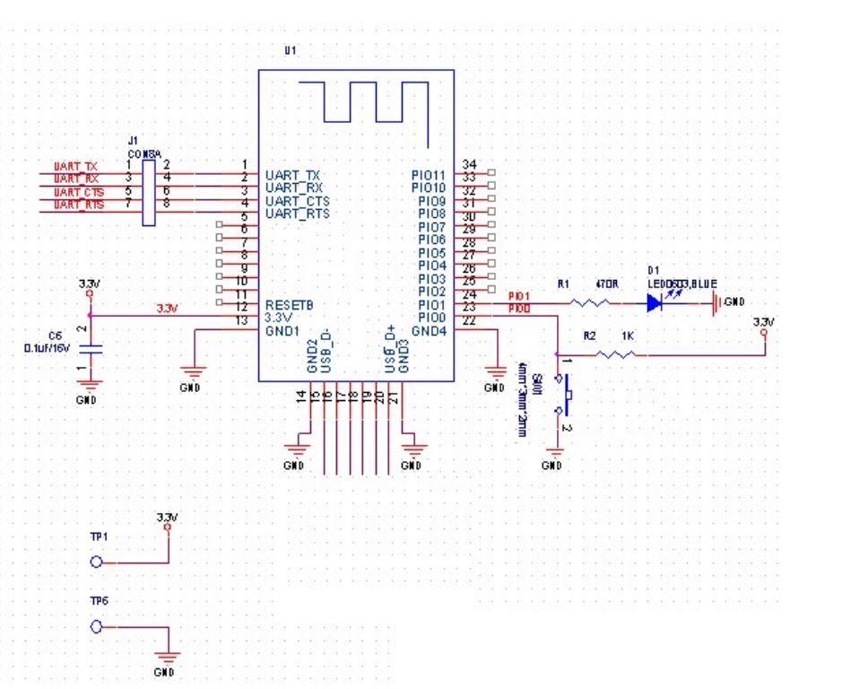

# Schematic




# Usage

python3 hm10_hm11_ctl.py -h
```
usage: hm10_hm11_ctl [-h] [-v] [-d] [-i INTERFACE] [-r ROLE] [-p POWER] [-e] [-c CUSTOMCOMMAND] [-m SETMAC] [-a SETADV] [-w SETWHITEMAC] [-l LISTNUMBER] [-b] [-n NAME] [-x CONNECTMAC]

a control tool to derive hm10_hm11 ble devices

optional arguments:
  -h, --help            show this help message and exit
  -v, --version         show version number and return
  -d, --verbose         verbosity setting
  -i INTERFACE, --interface INTERFACE
                        serial interface name
  -r ROLE, --role ROLE  "peripheral" or "central" whould be typed
  -p POWER, --power POWER
                        "sleep" or "wakeup" whould be typed
  -e, --remotecontrol   enable remote AT command control
  -c CUSTOMCOMMAND, --customcommand CUSTOMCOMMAND
                        to pass the argument directly to the module
  -m SETMAC, --setmac SETMAC
                        set MAC address
  -a SETADV, --setadv SETADV
                        set advertising value
  -w SETWHITEMAC, --setwhitemac SETWHITEMAC
                        add the mac address into white list
  -l LISTNUMBER, --listnumber LISTNUMBER
                        specify the list number (1-2-3) if setwhitemac is used
  -b, --battmonitor     enable batter monitor
  -n NAME, --name NAME  set module name, max len 12
  -x CONNECTMAC, --connectmac CONNECTMAC
                        type mac to be connected, max len 12

hm10_hm11_ctl Help
```

# How to Use

1. Run as Peripheral

```
python3 hm10_hm11_ctl.py -i <interface: eg /dev/ttyACM0>
```

2. Run as Central

```
python3 hm10_hm11_ctl.py -i <interface: eg /dev/ttyACM0> -r central -x <mac, eg: 546C0EA04925>
```

# Notes

[More on commands](./docs/HM-10_11_datasheet.pdf)
